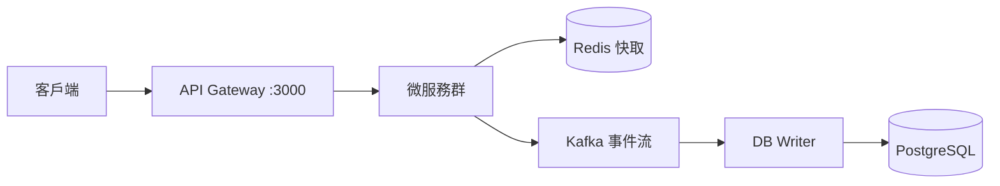

# Sugar Daddy 🍭

> 基於微服務架構的約會平台，採用 NestJS、Next.js 和 PostgreSQL 構建

[](https://nestjs.com/)
[](https://nextjs.org/)
[](https://www.postgresql.org/)
[](https://www.typescriptlang.org/)

## ✨ 特色

- 🏗️ **微服務架構** - 基於 Nx monorepo，13 個獨立微服務
- 🔄 **CQRS + Event Sourcing** - 讀寫分離，事件驅動
- 🚀 **高可用設計** - PostgreSQL 主從架構、Redis Sentinel
- 🔐 **安全防護** - JWT 認證、速率限制、Docker Secrets
- 📊 **完整監控** - 分散式追蹤、健康檢查、日誌聚合
- 🎨 **現代前端** - Next.js 14 App Router、Tailwind CSS

## 📖 快速連結

| 文檔 | 說明 |
|------|------|
| 📚 [**文檔中心**](./docs/README.md) | 完整的文檔索引和導航 |
| 🚀 [快速開始](./docs/guides/QUICK_START.md) | 5 分鐘上手指南 |
| 🏗️ [服務總覽](./docs/architecture/SERVICES_OVERVIEW.md) | 所有微服務架構圖 |
| 🔧 [開發指南](./docs/technical/development.md) | 本地開發環境設置 |
| 📡 [API 文檔](./docs/technical/api.md) | RESTful API 參考 |
| ⚙️ [環境變數](./docs/technical/environment-variables.md) | 配置說明 |
| 🚢 [部署指南](./docs/technical/deployment.md) | Docker 與生產部署 |
| ❓ [FAQ](./docs/guides/FAQ.md) | 常見問題解答 |

---

## 🏗️ 系統架構

Sugar Daddy 採用**微服務架構** + **CQRS** 模式：



### 核心服務

| 服務 | 端口 | 職責 | README |
|------|------|------|--------|
| **api-gateway** | 3000 | 統一入口、路由、認證 | [📄](apps/api-gateway/README.md) |
| **auth-service** | 3002 | 用戶認證與授權 | [📄](apps/auth-service/README.md) |
| **user-service** | 3001 | 用戶資料管理 | [📄](apps/user-service/README.md) |
| **content-service** | 3006 | 內容發布與管理 | [📄](apps/content-service/README.md) |
| **payment-service** | 3007 | Stripe 支付整合 | [📄](apps/payment-service/README.md) |
| **subscription-service** | 3005 | 訂閱管理 | [📄](apps/subscription-service/README.md) |
| **matching-service** | 3003 | 配對推薦算法 | [📄](apps/matching-service/README.md) |
| **media-service** | 3008 | 媒體上傳處理 | [📄](apps/media-service/README.md) |
| **db-writer-service** | — | CQRS 寫入層 | [📄](apps/db-writer-service/README.md) |

📋 [完整服務列表與架構圖](./docs/architecture/SERVICES_OVERVIEW.md)

### 數據流模式

#### 寫入（異步）
```
Client → Service → Redis → Kafka → DB Writer → PostgreSQL
                     ↓
                  即時返回
```

#### 讀取（同步）
```
Client → Service → Redis (Cache Hit) → 返回
                     ↓ (Cache Miss)
                PostgreSQL → 更新快取 → 返回
```

---

## 🚀 快速開始

### 方式一：使用 npm 腳本（推薦）

```bash
# 1. 安裝依賴
npm install

# 2. 設置環境變數
cp .env.example .env

# 3. 啟動開發環境（自動啟動 Docker 基礎設施 + 所有服務）
npm run dev

# 4. 訪問應用
# - 前端: http://localhost:4200
# - API: http://localhost:3000
# - Admin: http://localhost:4300
```

### 方式二：使用 Docker Compose

```bash
# 1. 設置 Docker Secrets
./scripts/setup-secrets.sh

# 2. 啟動完整環境
docker-compose --profile full up -d

# 3. 查看日誌
docker-compose logs -f
```

📖 **詳細步驟**: [快速開始指南](./docs/guides/QUICK_START.md)

---

## 💻 開發常用命令

```bash
# 開發
npm run dev              # 啟動所有服務
npm run dev:stop         # 停止所有服務
npm run dev:reset        # 重置環境

# 單一服務
nx serve api-gateway     # 啟動 API Gateway
nx serve web             # 啟動前端
nx serve admin           # 啟動管理後台

# 測試
npm run test:unit        # 單元測試
npm run test:e2e         # E2E 測試
npm run test:integration # 整合測試

# 建置
npm run build:all        # 建置所有項目
npm run build:backend    # 只建置後端
npm run build:frontend   # 只建置前端

# 代碼品質
npm run lint             # 檢查代碼風格
npm run format           # 格式化代碼
```

📖 **完整命令列表**: [開發指南](./docs/technical/development.md) | [NPM Scripts 說明](./docs/technical/npm-scripts.md)

---

## 🛠️ 技術棧

### 後端
- **框架**: NestJS
- **語言**: TypeScript
- **資料庫**: PostgreSQL 14+ (主從架構)
- **快取**: Redis 7+ (Sentinel)
- **訊息佇列**: Kafka
- **ORM**: TypeORM
- **認證**: JWT + Passport
- **支付**: Stripe

### 前端
- **框架**: Next.js 14 (App Router)
- **語言**: TypeScript
- **樣式**: Tailwind CSS
- **UI 組件**: shadcn/ui (Admin)
- **狀態管理**: React Query

### DevOps
- **容器化**: Docker + Docker Compose
- **Monorepo**: Nx
- **監控**: Jaeger (分散式追蹤)
- **CI/CD**: GitHub Actions

---

## 📂 專案結構

```
suggar-daddy/
├── apps/                    # 應用程式
│   ├── api-gateway/        # API 閘道
│   ├── auth-service/       # 認證服務
│   ├── user-service/       # 用戶服務
│   ├── content-service/    # 內容服務
│   ├── payment-service/    # 支付服務
│   ├── web/                # 用戶前端
│   └── admin/              # 管理後台
├── libs/                    # 共享程式庫
│   ├── common/             # 通用模組
│   ├── database/           # 資料庫設定
│   ├── kafka/              # Kafka 模組
│   ├── redis/              # Redis 模組
│   └── dto/                # 資料傳輸物件
├── docs/                    # 文檔
├── scripts/                 # 開發腳本
└── infrastructure/          # 基礎設施配置
```

---

## 🤝 貢獻指南

歡迎貢獻！請遵循以下步驟：

1. Fork 本專案
2. 建立功能分支 (`git checkout -b feature/amazing-feature`)
3. 提交變更 (`git commit -m 'Add some amazing feature'`)
4. 推送到分支 (`git push origin feature/amazing-feature`)
5. 開啟 Pull Request

📖 **詳細指南**: [貢獻指南](./docs/CONTRIBUTING.md) | [團隊工作流程](./docs/TEAM-WORKFLOW.md)

---

## 📄 授權

本專案採用 MIT 授權條款 - 詳見 [LICENSE](LICENSE) 文件

---

## 💬 支援

如有問題或建議，歡迎：
- 📧 聯繫開發團隊
- 🐛 [提交 Issue](https://github.com/your-repo/suggar-daddy/issues)
- 💬 [討論區](https://github.com/your-repo/suggar-daddy/discussions)
