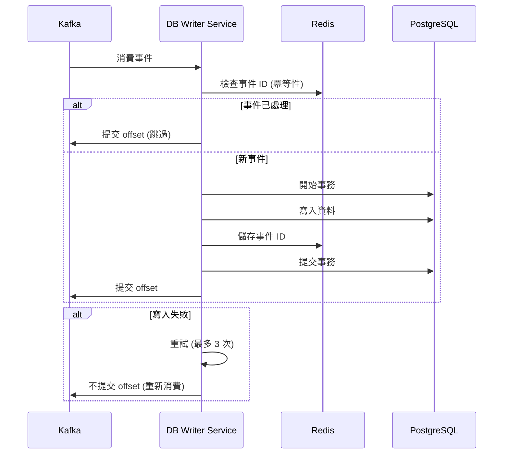

# DB Writer Service

## 📖 簡介

DB Writer Service 是整個系統中**唯一**負責寫入 PostgreSQL 資料庫的服務，採用 CQRS (Command Query Responsibility Segregation) 和 Event Sourcing 模式，確保資料一致性和系統解耦。

## 🎯 職責說明

- **事件消費**: 監聽 Kafka 所有寫入相關事件
- **資料持久化**: 將事件轉換為資料庫寫入操作
- **事務管理**: 確保資料庫寫入的 ACID 特性
- **冪等性**: 處理重複事件，避免資料重複
- **錯誤重試**: 失敗事件的重試機制
- **資料完整性**: 驗證資料完整性和關聯性

## 🚀 端口和路由

- **端口**: `3010`（僅用於健康檢查，無 HTTP API）
- **模式**: Kafka Consumer（事件驅動）

## 🛠️ 技術棧

- **框架**: NestJS
- **語言**: TypeScript
- **ORM**: TypeORM
- **資料庫**: PostgreSQL
- **訊息佇列**: Kafka Consumer
- **快取**: Redis（用於冪等性檢查）

## ⚙️ 環境變數

```bash
# 服務端口（僅健康檢查）
DB_WRITER_SERVICE_PORT=3010
PORT=3010

# PostgreSQL 設定
DB_HOST=localhost
DB_PORT=5432
DB_USERNAME=postgres
DB_PASSWORD=postgres
DB_DATABASE=suggar_daddy
DB_POOL_SIZE=20                    # 連線池大小
DB_CONNECTION_TIMEOUT=5000         # 連線超時（毫秒）

# Kafka 設定
KAFKA_BROKERS=localhost:9092
KAFKA_CLIENT_ID=db-writer-service
KAFKA_GROUP_ID=db-writer-group
KAFKA_AUTO_COMMIT=false            # 手動提交確保資料寫入成功

# Redis 設定（冪等性檢查）
REDIS_HOST=localhost
REDIS_PORT=6379
IDEMPOTENCY_TTL=86400              # 事件 ID 快取 24 小時

# 重試設定
MAX_RETRY_ATTEMPTS=3
RETRY_DELAY_MS=1000
EXPONENTIAL_BACKOFF=true

# 批次處理
BATCH_SIZE=10                      # 批次處理事件數量
BATCH_TIMEOUT_MS=1000              # 批次超時
```

## 💻 本地開發指令

```bash
# 啟動開發伺服器
nx serve db-writer-service

# 建置
nx build db-writer-service

# 執行測試
nx test db-writer-service

# Lint 檢查
nx lint db-writer-service

# 資料庫遷移
npm run typeorm migration:run
npm run typeorm migration:generate -- -n MigrationName
```

## 📊 監聽的 Kafka 主題

### 用戶相關 (user.*)

```typescript
// user.created
{
  eventId: string;
  eventType: 'user.created';
  timestamp: Date;
  data: {
    userId: string;
    username: string;
    email: string;
    role: UserRole;
    // ...
  }
}

// user.updated
{
  eventId: string;
  eventType: 'user.updated';
  timestamp: Date;
  data: {
    userId: string;
    updates: {
      displayName?: string;
      bio?: string;
      // ...
    }
  }
}

// user.deleted
// user.followed
// user.unfollowed
// user.blocked
// user.unblocked
```

### 內容相關 (content.*)

```typescript
// content.post.created
{
  eventId: string;
  eventType: 'content.post.created';
  timestamp: Date;
  data: {
    postId: string;
    authorId: string;
    content: string;
    mediaUrls: string[];
    visibility: string;
    // ...
  }
}

// content.post.updated
// content.post.deleted
// content.post.liked
// content.comment.created
// content.story.created
// content.video.created
```

### 支付相關 (payment.*)

```typescript
// payment.completed
{
  eventId: string;
  eventType: 'payment.completed';
  timestamp: Date;
  data: {
    transactionId: string;
    userId: string;
    amount: number;
    type: 'TIP' | 'PURCHASE' | 'SUBSCRIPTION';
    // ...
  }
}

// payment.tip.created
// payment.refunded
// wallet.updated
// withdrawal.requested
```

### 訂閱相關 (subscription.*)

```typescript
// subscription.created
{
  eventId: string;
  eventType: 'subscription.created';
  timestamp: Date;
  data: {
    subscriptionId: string;
    userId: string;
    tierId: string;
    status: string;
    // ...
  }
}

// subscription.renewed
// subscription.canceled
// subscription.expired
```

### 技能相關 (skill.*)

```typescript
// skill.created
// skill.updated
// skill.user.added
// skill.user.removed
```

### 通知和訊息 (notification.*, message.*)

```typescript
// notification.created
// message.created
// message.read
```

## 🔄 資料流程

### 事件處理流程



### 批次處理流程

1. 累積事件到批次大小 (預設 10)
2. 或達到超時時間 (預設 1 秒)
3. 批次開始事務
4. 批次寫入所有事件
5. 批次提交事務和 offset

## 🛡️ 冪等性保證

### 方案

使用 Redis 儲存已處理的事件 ID：

```typescript
const eventKey = `processed:${eventId}`;
const exists = await redis.exists(eventKey);

if (exists) {
  // 跳過已處理的事件
  return;
}

// 處理事件
await processEvent(event);

// 標記為已處理（24 小時過期）
await redis.setex(eventKey, 86400, '1');
```

### 為什麼需要冪等性

- Kafka 可能重複投遞事件
- 服務重啟時可能重新消費未提交的 offset
- 網路問題導致的重試

## 📈 效能優化

### 批次寫入

```typescript
// 批次插入多筆資料
await postRepository
  .createQueryBuilder()
  .insert()
  .values(posts)
  .execute();
```

### 連線池管理

```typescript
{
  type: 'postgres',
  poolSize: 20,
  extra: {
    max: 20,
    idleTimeoutMillis: 30000,
    connectionTimeoutMillis: 5000
  }
}
```

### 索引優化

確保所有查詢條件和外鍵都有索引。

## 🔧 錯誤處理

### 重試機制

```typescript
async function processEventWithRetry(event: Event, maxRetries = 3) {
  for (let attempt = 1; attempt <= maxRetries; attempt++) {
    try {
      await processEvent(event);
      return; // 成功
    } catch (error) {
      if (attempt === maxRetries) {
        // 最後一次重試失敗，發送到 Dead Letter Queue
        await sendToDeadLetterQueue(event, error);
        throw error;
      }
      // 指數退避
      await sleep(1000 * Math.pow(2, attempt - 1));
    }
  }
}
```

### Dead Letter Queue (DLQ)

失敗的事件發送到 DLQ 主題：

- `db-writer.dlq`

可手動重新處理 DLQ 中的事件。

## 📊 監控指標

### 關鍵指標

- **事件處理速率**: events/second
- **處理延遲**: 從事件產生到寫入資料庫的時間
- **錯誤率**: 失敗事件 / 總事件
- **重試次數**: 平均重試次數
- **DLQ 大小**: Dead Letter Queue 中的事件數
- **資料庫連線**: 使用中的連線數

### 健康檢查

```
GET /health

Response 200:
{
  "status": "healthy",
  "kafka": {
    "connected": true,
    "lag": 0  // Consumer lag
  },
  "database": {
    "connected": true,
    "activeConnections": 5,
    "poolSize": 20
  },
  "redis": {
    "connected": true
  },
  "lastProcessedEvent": "2024-01-01T00:00:00.000Z"
}
```

## 🧪 測試

```bash
# 單元測試
nx test db-writer-service

# 整合測試（需要 Kafka 和 PostgreSQL）
nx test db-writer-service --testPathPattern=integration

# 覆蓋率報告
nx test db-writer-service --coverage
```

### 測試事件投遞

```bash
# 使用 Kafka 工具投遞測試事件
kafka-console-producer --broker-list localhost:9092 --topic user.created
> {"eventId":"test-123","eventType":"user.created","timestamp":"2024-01-01T00:00:00.000Z","data":{...}}
```

## 📚 相關文檔

- [服務總覽](../../docs/architecture/SERVICES_OVERVIEW.md)
- [CQRS 模式](../../docs/architecture/ADR-001-Pre-Launch-Architecture-Review.md)
- [資料庫架構](../../libs/database/README.md)

## 🤝 依賴服務

- **PostgreSQL**: 唯一寫入目標
- **Kafka**: 事件來源
- **Redis**: 冪等性檢查

## 🚨 已知問題

- Dead Letter Queue 處理介面待開發
- 批次寫入失敗時的部分回滾機制待完善
- 資料庫分片策略尚未實作
- 跨事件的事務一致性保證有限

請參考 [BUSINESS_LOGIC_GAPS.md](../../docs/BUSINESS_LOGIC_GAPS.md#db-writer-service)。

## 📝 開發注意事項

1. **唯一寫入者**: 絕對不要在其他服務中直接寫入 PostgreSQL
2. **事件順序**: 同一實體的事件需保證順序（使用 Kafka Partition Key）
3. **Schema 遷移**: 資料庫 Schema 變更需考慮向後相容性
4. **監控延遲**: 監控 Kafka Consumer Lag，確保不累積
5. **容量規劃**: 根據事件頻率規劃資料庫寫入容量
6. **備份策略**: 定期備份資料庫，確保資料安全
7. **測試覆蓋**: 每種事件類型都需要測試案例

## 🎯 擴展性

### 水平擴展

- 增加 Consumer Group 的 Consumer 數量
- Kafka Topic 的 Partition 數量需 >= Consumer 數量

### 垂直擴展

- 增加資料庫連線池大小
- 提升批次處理大小

### 資料庫分片

未來可根據 `userId` 進行分片，分散寫入壓力。
