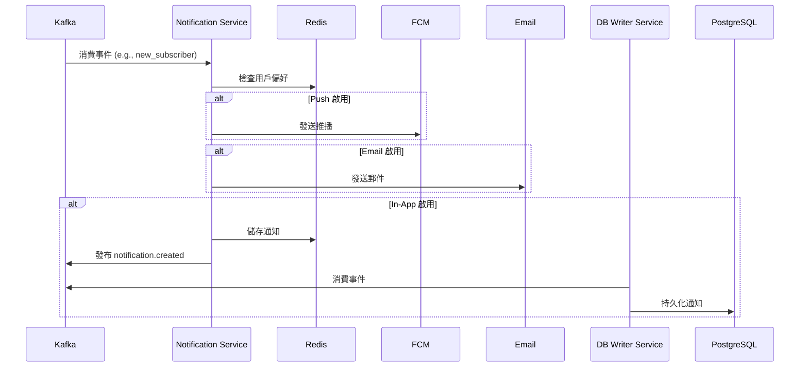

# Notification Service

## 📖 簡介

Notification Service 負責處理平台上所有通知相關功能，包括推播通知、Email 通知、站內通知和通知模板管理，確保用戶及時收到重要訊息。

## 🎯 職責說明

- **推播通知**: Web Push、Mobile Push (FCM)
- **Email 通知**: 交易郵件、系統通知郵件
- **站內通知**: 平台內的通知中心
- **即時通知**: WebSocket 實時推送
- **通知模板**: 可配置的通知模板系統
- **通知偏好**: 用戶自定義通知設定
- **批次通知**: 群發通知功能

## 🚀 端口和路由

- **端口**: `3004`
- **模式**: 主要為 Kafka Consumer（事件驅動）+ HTTP API

## 🛠️ 技術棧

- **框架**: NestJS
- **語言**: TypeScript
- **Email**: NodeMailer / SendGrid
- **Push 通知**: FCM (Firebase Cloud Messaging)
- **模板引擎**: Handlebars
- **ORM**: TypeORM
- **快取**: Redis
- **事件**: Kafka Consumer & Producer

## ⚙️ 環境變數

```bash
# 服務端口
NOTIFICATION_SERVICE_PORT=3004
PORT=3004

# 資料庫連接
DB_HOST=localhost
DB_PORT=5432
DB_USERNAME=postgres
DB_PASSWORD=postgres
DB_DATABASE=suggar_daddy

# Redis 設定
REDIS_HOST=localhost
REDIS_PORT=6379

# Kafka 設定
KAFKA_BROKERS=localhost:9092
KAFKA_CLIENT_ID=notification-service
KAFKA_GROUP_ID=notification-group

# Email 設定（使用 SendGrid）
SENDGRID_API_KEY=your-sendgrid-api-key
EMAIL_FROM=noreply@sugardaddy.com
EMAIL_FROM_NAME=Sugar Daddy

# 或使用 SMTP
SMTP_HOST=smtp.gmail.com
SMTP_PORT=587
SMTP_USER=your-email@gmail.com
SMTP_PASSWORD=your-password
SMTP_SECURE=false

# Firebase Cloud Messaging (推播)
FCM_SERVER_KEY=your-fcm-server-key
FCM_PROJECT_ID=your-firebase-project-id

# Web Push (VAPID)
VAPID_PUBLIC_KEY=your-vapid-public-key
VAPID_PRIVATE_KEY=your-vapid-private-key
VAPID_SUBJECT=mailto:admin@sugardaddy.com

# 通知設定
MAX_RETRY_ATTEMPTS=3
BATCH_SIZE=100
NOTIFICATION_RETENTION_DAYS=90
```

## 💻 本地開發指令

```bash
# 啟動開發伺服器
nx serve notification-service

# 建置
nx build notification-service

# 執行測試
nx test notification-service

# Lint 檢查
nx lint notification-service

# 測試 Email 發送
curl -X POST http://localhost:3004/api/notifications/test-email \
  -H "Authorization: Bearer <token>"
```

## 📡 API 端點列表

### 通知管理

#### 取得通知列表

```
GET /api/notifications?page=1&limit=20&unreadOnly=false
Authorization: Bearer <token>

Response 200:
{
  "notifications": [
    {
      "notificationId": "uuid",
      "type": "NEW_SUBSCRIBER",
      "title": "New Subscriber!",
      "message": "johndoe subscribed to your content",
      "data": {
        "subscriberId": "uuid",
        "subscriptionId": "uuid"
      },
      "isRead": false,
      "createdAt": "2024-01-01T00:00:00.000Z"
    }
  ],
  "total": 150,
  "unreadCount": 25,
  "page": 1
}
```

#### 標記為已讀

```
POST /api/notifications/:notificationId/read
Authorization: Bearer <token>

Response 200:
{
  "notificationId": "uuid",
  "isRead": true,
  "readAt": "2024-01-01T00:00:00.000Z"
}
```

#### 全部標記為已讀

```
POST /api/notifications/read-all
Authorization: Bearer <token>

Response 200:
{
  "marked": 25,
  "readAt": "2024-01-01T00:00:00.000Z"
}
```

#### 刪除通知

```
DELETE /api/notifications/:notificationId
Authorization: Bearer <token>

Response 204: No Content
```

#### 取得未讀數量

```
GET /api/notifications/unread-count
Authorization: Bearer <token>

Response 200:
{
  "unreadCount": 25
}
```

### 通知偏好設定

#### 取得通知偏好

```
GET /api/notifications/preferences
Authorization: Bearer <token>

Response 200:
{
  "userId": "uuid",
  "preferences": {
    "newSubscriber": {
      "push": true,
      "email": true,
      "inApp": true
    },
    "newTip": {
      "push": true,
      "email": true,
      "inApp": true
    },
    "newMessage": {
      "push": true,
      "email": false,
      "inApp": true
    },
    "newComment": {
      "push": true,
      "email": false,
      "inApp": true
    },
    "subscriptionRenewal": {
      "push": false,
      "email": true,
      "inApp": true
    }
  },
  "updatedAt": "2024-01-01T00:00:00.000Z"
}
```

#### 更新通知偏好

```
PATCH /api/notifications/preferences
Authorization: Bearer <token>
Content-Type: application/json

{
  "newSubscriber": {
    "push": false,
    "email": true,
    "inApp": true
  }
}

Response 200:
{
  "preferences": {...},
  "updatedAt": "2024-01-01T00:00:00.000Z"
}
```

### 推播設備管理

#### 註冊推播設備

```
POST /api/notifications/devices
Authorization: Bearer <token>
Content-Type: application/json

{
  "deviceToken": "fcm-token-here",
  "platform": "WEB",  // WEB, IOS, ANDROID
  "deviceName": "Chrome on MacBook"
}

Response 201:
{
  "deviceId": "uuid",
  "deviceToken": "...",
  "platform": "WEB",
  "createdAt": "2024-01-01T00:00:00.000Z"
}
```

#### 取得已註冊設備

```
GET /api/notifications/devices
Authorization: Bearer <token>

Response 200:
{
  "devices": [
    {
      "deviceId": "uuid",
      "platform": "WEB",
      "deviceName": "Chrome on MacBook",
      "lastUsedAt": "2024-01-01T00:00:00.000Z",
      "createdAt": "2023-12-01T00:00:00.000Z"
    }
  ],
  "total": 3
}
```

#### 移除設備

```
DELETE /api/notifications/devices/:deviceId
Authorization: Bearer <token>

Response 204: No Content
```

## 📊 監聽的 Kafka 事件

### 訂閱相關

```typescript
// subscription.created - 新訂閱
→ 通知創作者: "You have a new subscriber!"
→ 通知訂閱者: "Welcome to {creator}'s exclusive content"

// subscription.renewed - 訂閱續訂
→ 通知訂閱者: "Your subscription to {creator} has been renewed"

// subscription.canceled - 訂閱取消
→ 通知創作者: "{user} canceled their subscription"

// subscription.expired - 訂閱過期
→ 通知訂閱者: "Your subscription to {creator} has expired"
```

### 支付相關

```typescript
// payment.tip.created - 收到打賞
→ 通知創作者: "{user} tipped you ${amount}!"

// payment.completed - 支付完成
→ 通知用戶: "Payment of ${amount} completed"

// withdrawal.completed - 提現完成
→ 通知創作者: "Withdrawal of ${amount} has been processed"
```

### 內容相關

```typescript
// content.post.created - 新貼文
→ 通知訂閱者: "{creator} posted new content"

// content.post.liked - 貼文被點讚
→ 通知創作者: "{user} liked your post"

// content.comment.created - 新評論
→ 通知貼文作者: "{user} commented on your post"
→ 通知被回覆者: "{user} replied to your comment"
```

### 訊息相關

```typescript
// message.created - 新訊息
→ 通知接收者: "New message from {sender}"

// message.dm_purchase - 付費訊息購買
→ 通知創作者: "{user} purchased your message"
```

### 用戶相關

```typescript
// user.followed - 被關注
→ 通知創作者: "{user} started following you"

// admin.user.banned - 帳號被封禁
→ 通知用戶: "Your account has been suspended"
```

## 📧 通知類型

### 站內通知 (In-App)

顯示在平台通知中心：

```typescript
{
  type: 'NEW_SUBSCRIBER',
  title: 'New Subscriber!',
  message: 'johndoe subscribed to your content',
  icon: '🎉',
  actionUrl: '/subscribers',
  data: { subscriberId: 'uuid' }
}
```

### 推播通知 (Push)

透過 FCM 或 Web Push 發送：

```typescript
{
  notification: {
    title: 'New Subscriber!',
    body: 'johndoe subscribed to your content',
    icon: '/icon.png',
    badge: '/badge.png',
    click_action: 'https://app.sugardaddy.com/subscribers'
  },
  data: {
    type: 'NEW_SUBSCRIBER',
    subscriberId: 'uuid'
  }
}
```

### Email 通知

使用模板發送郵件：

```html
Subject: New Subscriber - Sugar Daddy

Hi {{creatorName}},

Great news! {{subscriberName}} just subscribed to your content.

View your subscribers: {{subscribersUrl}}

Best regards,
The Sugar Daddy Team
```

## 📊 資料模型

### Notification Entity

```typescript
{
  notificationId: string;
  userId: string;
  type: string;  // NEW_SUBSCRIBER, NEW_TIP, NEW_MESSAGE, etc.
  title: string;
  message: string;
  data: Record<string, any>;  // 額外資料
  icon?: string;
  actionUrl?: string;
  isRead: boolean;
  readAt?: Date;
  sentVia: string[];  // ['PUSH', 'EMAIL', 'IN_APP']
  createdAt: Date;
  expiresAt?: Date;
}
```

### NotificationPreferences Entity

```typescript
{
  userId: string;
  preferences: Record<string, {
    push: boolean;
    email: boolean;
    inApp: boolean;
  }>;
  updatedAt: Date;
}
```

### Device Entity

```typescript
{
  deviceId: string;
  userId: string;
  deviceToken: string;
  platform: 'WEB' | 'IOS' | 'ANDROID';
  deviceName?: string;
  isActive: boolean;
  lastUsedAt: Date;
  createdAt: Date;
}
```

## 🔄 通知發送流程



## 🎯 通知模板

### 模板管理

模板儲存在 `templates/` 目錄：

```
templates/
├── email/
│   ├── new-subscriber.hbs
│   ├── payment-received.hbs
│   └── subscription-expired.hbs
└── push/
    ├── new-message.json
    └── new-tip.json
```

### 模板範例 (Handlebars)

```handlebars
<!-- templates/email/new-subscriber.hbs -->
<!DOCTYPE html>
<html>
<body>
  <h1>🎉 New Subscriber!</h1>
  <p>Hi {{creatorName}},</p>
  <p><strong>{{subscriberName}}</strong> just subscribed to your content.</p>
  <a href="{{subscribersUrl}}">View Subscribers</a>
</body>
</html>
```

## 📤 Kafka 事件

### Consumer (監聽)

- `subscription.*` - 訂閱事件
- `payment.*` - 支付事件
- `content.*` - 內容事件
- `message.*` - 訊息事件
- `user.followed` - 關注事件

### Producer (發送)

- `notification.created` - 通知創建
- `notification.sent` - 通知發送成功
- `notification.failed` - 通知發送失敗

## 🧪 測試

```bash
# 單元測試
nx test notification-service

# 覆蓋率報告
nx test notification-service --coverage

# 測試 Email 發送
npm run test:email

# 測試推播通知
npm run test:push
```

## 📚 相關文檔

- [服務總覽](../../docs/architecture/SERVICES_OVERVIEW.md)
- [SendGrid 文檔](https://docs.sendgrid.com/)
- [FCM 文檔](https://firebase.google.com/docs/cloud-messaging)
- [業務邏輯缺口](../../docs/BUSINESS_LOGIC_GAPS.md#notification-service)

## 🤝 依賴服務

- **Kafka**: 事件消費
- **Redis**: 偏好快取
- **PostgreSQL**: 通知歷史（透過 DB Writer）
- **SendGrid / SMTP**: Email 發送
- **FCM**: 推播通知

## 🚨 已知問題

- Mobile App 推播整合待完成
- 通知批次發送效能待優化
- Email 模板編輯器待開發
- 通知統計和分析功能缺失
- 多語言通知支援有限

請參考 [BUSINESS_LOGIC_GAPS.md](../../docs/BUSINESS_LOGIC_GAPS.md#notification-service)。

## 📝 開發注意事項

1. **用戶偏好**: 發送前務必檢查用戶通知偏好
2. **頻率限制**: 避免短時間內重複通知
3. **重試機制**: Email/Push 發送失敗需要重試
4. **設備管理**: 定期清理無效的設備 Token
5. **模板版本**: 模板變更需向後相容
6. **隱私保護**: 敏感資訊不應出現在推播通知中
7. **批次發送**: 大量通知需使用批次 API 降低成本
