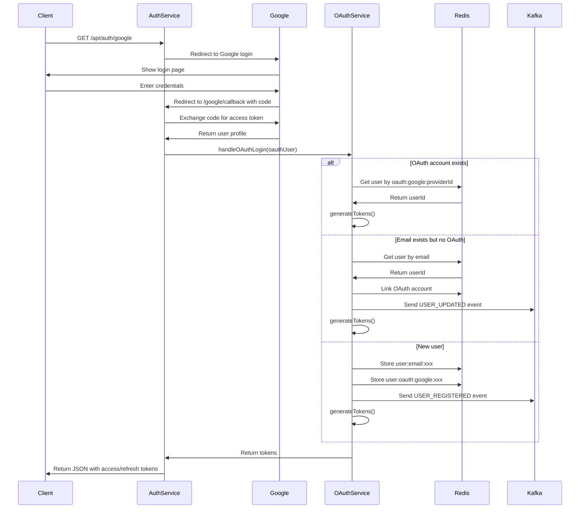

# OAuth 第三方登入整合指南

## 📋 目錄

1. [概述](#概述)
2. [支持的 OAuth 提供商](#支持的-oauth-提供商)
3. [核心組件](#核心組件)
4. [環境配置](#環境配置)
5. [Google OAuth 設置](#google-oauth-設置)
6. [Apple Sign-In 設置](#apple-sign-in-設置)
7. [Controller 整合](#controller-整合)
8. [工作流程](#工作流程)
9. [安全性考量](#安全性考量)
10. [錯誤處理](#錯誤處理)
11. [測試](#測試)
12. [常見問題](#常見問題)

---

## 概述

本系統實現了完整的 OAuth 2.0 第三方登入功能，支持 **Google** 和 **Apple Sign-In**。OAuth 登入可以：

- ✅ 自動創建新用戶（首次登入）
- ✅ 自動綁定 OAuth 帳號到現有 email
- ✅ 支持多個 OAuth 提供商綁定到同一帳號
- ✅ Email 自動驗證（來自 OAuth 提供商）
- ✅ 無需密碼註冊
- ✅ 統一的 JWT token 生成

---

## 支持的 OAuth 提供商

| 提供商 | 狀態 | HTTP Methods | 特點 |
|--------|------|--------------|------|
| **Google** | ✅ 已實現 | GET | - 最常用<br>- 配置簡單<br>- 提供照片 |
| **Apple** | ✅ 已實現 | POST | - iOS/macOS 必須<br>- 隱私友善<br>- 配置複雜 |

---

## 核心組件

### 1. **GoogleStrategy** (`oauth-google.strategy.ts`)

使用 `passport-google-oauth20` 實現 Google OAuth 2.0 登入。

**功能**:
- 從 Google 獲取用戶 profile
- 提取 email、displayName、照片
- 驗證 email 是否已驗證

### 2. **AppleStrategy** (`oauth-apple.strategy.ts`)

使用 `passport-apple` 實現 Apple Sign-In。

**功能**:
- 從 Apple 獲取用戶資料
- 處理 Apple 的特殊認證流程
- 僅在首次提供用戶名稱（需存儲）

### 3. **OAuthService** (`oauth.service.ts`)

核心業務邏輯服務，處理 OAuth 登入流程。

**功能**:
- 檢查 OAuth 帳號是否已存在
- 檢查 email 是否已被註冊
- 自動創建新用戶或綁定現有用戶
- 生成 JWT tokens
- 發送 Kafka 事件（寫入 DB）

---

## 環境配置

### Google OAuth

在 `.env` 或環境變數中添加：

```bash
# Google OAuth 2.0
GOOGLE_CLIENT_ID=your-google-client-id.apps.googleusercontent.com
GOOGLE_CLIENT_SECRET=your-google-client-secret
GOOGLE_CALLBACK_URL=http://localhost:3002/api/auth/google/callback
```

### Apple Sign-In

在 `.env` 或環境變數中添加：

```bash
# Apple Sign-In
APPLE_CLIENT_ID=com.yourdomain.yourapp
APPLE_TEAM_ID=YOUR_TEAM_ID
APPLE_KEY_ID=YOUR_KEY_ID
APPLE_PRIVATE_KEY_PATH=/path/to/AuthKey_YOUR_KEY_ID.p8
APPLE_CALLBACK_URL=http://localhost:3002/api/auth/apple/callback
```

---

## Google OAuth 設置

### 步驟 1: 創建 Google Cloud 專案

1. 前往 [Google Cloud Console](https://console.cloud.google.com/)
2. 創建新專案或選擇現有專案
3. 啟用 **Google+ API** 或 **People API**

### 步驟 2: 創建 OAuth 2.0 憑證

1. 導航到：**APIs & Services > Credentials**
2. 點擊 **Create Credentials > OAuth client ID**
3. 選擇 **Application type: Web application**
4. 設置 **Authorized redirect URIs**:
   ```
   http://localhost:3002/api/auth/google/callback
   https://yourdomain.com/api/auth/google/callback
   ```
5. 複製 **Client ID** 和 **Client Secret**

### 步驟 3: 配置 OAuth 同意畫面

1. 導航到：**APIs & Services > OAuth consent screen**
2. 選擇 **User Type: External**
3. 填寫應用資訊：
   - App name
   - User support email
   - Developer contact information
4. 添加 scopes:
   - `userinfo.email`
   - `userinfo.profile`

---

## Apple Sign-In 設置

### 步驟 1: 註冊 Apple Developer Program

1. 需要付費的 Apple Developer 帳號
2. 前往 [Apple Developer Portal](https://developer.apple.com/)

### 步驟 2: 創建 App ID

1. 導航到：**Certificates, Identifiers & Profiles**
2. 點擊 **Identifiers > +**
3. 選擇 **App IDs**
4. 勾選 **Sign in with Apple** capability
5. 記錄 **Bundle ID** (例如: `com.yourdomain.yourapp`)

### 步驟 3: 創建 Service ID

1. 點擊 **Identifiers > +**
2. 選擇 **Services IDs**
3. 填寫 **Identifier** (例如: `com.yourdomain.yourapp.service`)
4. 勾選 **Sign in with Apple**
5. 點擊 **Configure** 設置:
   - **Primary App ID**: 選擇步驟 2 的 App ID
   - **Website URLs > Domains**: `yourdomain.com`
   - **Return URLs**: `https://yourdomain.com/api/auth/apple/callback`

### 步驟 4: 創建 Private Key

1. 導航到：**Keys > +**
2. 選擇 **Sign in with Apple**
3. 選擇 **Primary App ID**
4. 下載 `.p8` 私鑰檔案 (⚠️ 只能下載一次！)
5. 記錄 **Key ID**

### 步驟 5: 獲取 Team ID

1. 導航到：**Membership**
2. 複製 **Team ID**

---

## Controller 整合

### 在 Auth Service 中整合

#### 1. 安裝依賴

```bash
npm install passport-google-oauth20 passport-apple
npm install --save-dev @types/passport-google-oauth20
```

#### 2. 更新 `auth.module.ts`

```typescript
import { Module } from '@nestjs/common';
import { PassportModule } from '@nestjs/passport';
import { JwtModule } from '@nestjs/jwt';
import { ConfigModule, ConfigService } from '@nestjs/config';
import { AuthController } from './auth.controller';
import { AuthService } from './auth.service';
import { JwtStrategy } from '@suggar-daddy/common';
import { GoogleStrategy, AppleStrategy, OAuthService } from '@suggar-daddy/common';
import { RedisModule } from '@suggar-daddy/redis';
import { KafkaModule } from '@suggar-daddy/kafka';

@Module({
  imports: [
    PassportModule.register({ defaultStrategy: 'jwt' }),
    JwtModule.registerAsync({
      imports: [ConfigModule],
      inject: [ConfigService],
      useFactory: (config: ConfigService) => ({
        secret: config.get<string>('JWT_SECRET'),
        signOptions: { expiresIn: '15m' },
      }),
    }),
    RedisModule,
    KafkaModule,
    ConfigModule,
  ],
  controllers: [AuthController],
  providers: [
    AuthService,
    OAuthService,
    JwtStrategy,
    GoogleStrategy,
    AppleStrategy,
  ],
  exports: [AuthService, OAuthService],
})
export class AuthModule {}
```

#### 3. 添加 OAuth Routes 到 Controller

```typescript
import {
  Controller,
  Get,
  Post,
  UseGuards,
  Request,
  HttpCode,
  HttpStatus,
} from '@nestjs/common';
import { AuthGuard } from '@nestjs/passport';
import { OAuthService } from '@suggar-daddy/common';
import type { TokenResponseDto } from '@suggar-daddy/dto';
import type { OAuthUser } from '@suggar-daddy/common';

@Controller('auth')
export class AuthController {
  constructor(
    private readonly authService: AuthService,
    private readonly oauthService: OAuthService,
  ) {}

  // ── Google OAuth ───────────────────────────────────────────────

  /**
   * 啟動 Google OAuth 流程
   * 
   * 使用方式:
   * GET /api/auth/google
   * 
   * 會重定向到 Google 登入頁面
   */
  @Get('google')
  @UseGuards(AuthGuard('google'))
  async googleAuth() {
    // Guard 會自動重定向到 Google
  }

  /**
   * Google OAuth Callback
   * 
   * Google 認證成功後會重定向到這裡
   * 返回 JWT tokens
   */
  @Get('google/callback')
  @UseGuards(AuthGuard('google'))
  @HttpCode(HttpStatus.OK)
  async googleAuthCallback(@Request() req): Promise<TokenResponseDto> {
    const oauthUser: OAuthUser = req.user;
    return this.oauthService.handleOAuthLogin(oauthUser);
  }

  // ── Apple Sign-In ──────────────────────────────────────────────

  /**
   * 啟動 Apple Sign-In 流程
   * 
   * 使用方式:
   * POST /api/auth/apple
   * 
   * 會重定向到 Apple 登入頁面
   * 
   * 注意: Apple 使用 POST 而非 GET
   */
  @Post('apple')
  @UseGuards(AuthGuard('apple'))
  async appleAuth() {
    // Guard 會自動重定向到 Apple
  }

  /**
   * Apple Sign-In Callback
   * 
   * Apple 認證成功後會重定向到這裡
   * 返回 JWT tokens
   */
  @Post('apple/callback')
  @UseGuards(AuthGuard('apple'))
  @HttpCode(HttpStatus.OK)
  async appleAuthCallback(@Request() req): Promise<TokenResponseDto> {
    const oauthUser: OAuthUser = req.user;
    return this.oauthService.handleOAuthLogin(oauthUser);
  }

  // ... 其他 auth endpoints (login, register, refresh, etc.)
}
```

---

## 工作流程

### Google OAuth 流程



### Apple Sign-In 流程

流程與 Google OAuth 類似，但有以下差異：

1. **HTTP Method**: 使用 **POST** 而非 GET
2. **Names**: Apple 僅在首次登入時提供用戶名稱
3. **Authentication**: 需要使用 `.p8` 私鑰簽名

---

## 安全性考量

### 1. ✅ HTTPS Only (Production)

⚠️ **重要**: OAuth callback URLs 必須使用 HTTPS (除了 localhost 開發環境)

```typescript
// 生產環境檢查
if (process.env.NODE_ENV === 'production' && !callbackURL.startsWith('https://')) {
  throw new Error('OAuth callback URL must use HTTPS in production');
}
```

### 2. ✅ State Parameter (CSRF Protection)

Passport 策略自動處理 `state` 參數以防止 CSRF 攻擊。

### 3. ✅ Email Verification

OAuth 提供商已驗證的 email 自動標記為 `emailVerified: true`。

### 4. ✅ Token Security

- Access Token: 15 分鐘短期有效
- Refresh Token: 7 天，存儲在 Redis
- JWT Secret: 必須使用強隨機字串

### 5. ⚠️ Private Key Protection (Apple)

Apple `.p8` 私鑰必須:
- 存儲在安全位置（不要提交到 Git）
- 使用環境變數指向檔案路徑
- 設置正確的檔案權限 (chmod 600)

```bash
chmod 600 /path/to/AuthKey_YOUR_KEY_ID.p8
```

### 6. ✅ Rate Limiting

建議對 OAuth endpoints 添加 rate limiting:

```typescript
@UseGuards(ThrottlerGuard)
@Throttle({ default: { limit: 10, ttl: 60000 } }) // 10 requests per minute
@Get('google')
async googleAuth() {}
```

---

## 錯誤處理

### 常見錯誤和處理

#### 1. **No email found in profile**

```typescript
{
  "statusCode": 401,
  "message": "No email found in Google profile",
  "error": "Unauthorized"
}
```

**原因**: OAuth 提供商未返回 email  
**解決**: 檢查 OAuth scopes 是否包含 `email`

#### 2. **Invalid callback URL**

```typescript
{
  "error": "redirect_uri_mismatch"
}
```

**原因**: Callback URL 不匹配  
**解決**: 確保環境變數中的 URL 與 OAuth Console 設置一致

#### 3. **Missing configuration**

```typescript
{
  "statusCode": 500,
  "message": "Google OAuth not configured"
}
```

**原因**: 缺少必要的環境變數  
**解決**: 檢查 `.env` 檔案

#### 4. **Apple private key not found**

```typescript
{
  "statusCode": 500,
  "message": "Apple private key file not found"
}
```

**原因**: `.p8` 檔案路徑錯誤  
**解決**: 確認 `APPLE_PRIVATE_KEY_PATH` 正確

---

## 測試

### 手動測試

#### Google OAuth

1. 啟動 auth-service:
   ```bash
   nx serve auth-service
   ```

2. 在瀏覽器訪問:
   ```
   http://localhost:3002/api/auth/google
   ```

3. 完成 Google 登入流程

4. 檢查返回的 tokens:
   ```json
   {
     "accessToken": "eyJhbGciOiJIUzI1NiIs...",
     "refreshToken": "a1b2c3d4e5f6...",
     "expiresIn": 900,
     "tokenType": "Bearer",
     "user": {
       "userId": "550e8400-e29b-41d4-a716-446655440000",
       "email": "user@gmail.com",
       "role": "basic",
       "displayName": "John Doe"
     }
   }
   ```

#### Apple Sign-In

1. 使用 Postman 或 curl:
   ```bash
   curl -X POST http://localhost:3002/api/auth/apple
   ```

2. 或在前端使用 Apple Sign-In button

### E2E 測試

創建 `auth-oauth.e2e.spec.ts`:

```typescript
import { Test, TestingModule } from '@nestjs/testing';
import { INestApplication } from '@nestjs/common';
import * as request from 'supertest';
import { AuthModule } from './auth.module';

describe('OAuth Authentication (e2e)', () => {
  let app: INestApplication;

  beforeAll(async () => {
    const moduleFixture: TestingModule = await Test.createTestingModule({
      imports: [AuthModule],
    }).compile();

    app = moduleFixture.createNestApplication();
    await app.init();
  });

  afterAll(async () => {
    await app.close();
  });

  describe('Google OAuth', () => {
    it('/auth/google (GET) should redirect to Google', () => {
      return request(app.getHttpServer())
        .get('/auth/google')
        .expect(302)
        .expect((res) => {
          expect(res.headers.location).toContain('accounts.google.com');
        });
    });

    // Note: Testing callback requires mocking Google's response
    it('/auth/google/callback (GET) with valid code should return tokens', async () => {
      // Mock Google OAuth response
      // ...
    });
  });

  describe('Apple Sign-In', () => {
    it('/auth/apple (POST) should redirect to Apple', () => {
      return request(app.getHttpServer())
        .post('/auth/apple')
        .expect(302)
        .expect((res) => {
          expect(res.headers.location).toContain('appleid.apple.com');
        });
    });
  });
});
```

---

## 常見問題

### Q1: 為什麼 Apple Sign-In 使用 POST 而非 GET？

**A**: Apple Sign-In 的安全模型要求使用 POST 請求，並且包含額外的安全參數。這是 Apple 的規範。

### Q2: Apple 的用戶名稱只在首次提供，之後怎麼辦？

**A**: 是的，Apple 僅在用戶首次授權時提供名稱。我們的系統會：
1. 首次登入時存儲名稱到 DB
2. 後續登入從 DB 讀取
3. 如果沒有名稱，使用 email 前綴作為 displayName

### Q3: 可以綁定多個 OAuth 帳號到同一個用戶嗎？

**A**: 可以！系統支持同一個 email 綁定多個 OAuth 提供商：
- user@example.com → Google
- user@example.com → Apple
- 兩個都指向同一個 userId

### Q4: 如果用戶先用密碼註冊，後來想用 OAuth 登入？

**A**: 系統會自動綁定！工作流程：
1. 用戶用密碼註冊 → email 存在於系統
2. 用戶用 Google 登入（同樣 email） → 系統檢測到 email 已存在
3. 系統自動綁定 Google OAuth 到該帳號
4. 用戶之後可以用密碼或 Google 登入

### Q5: OAuth 登入失敗後如何處理？

**A**: 系統會返回統一的錯誤響應：
```json
{
  "statusCode": 401,
  "message": "OAuth login failed: reason",
  "error": "Unauthorized",
  "correlationId": "uuid-here"
}
```

前端應該：
1. 顯示友善的錯誤訊息
2. 提供重試按鈕
3. 或引導用戶使用其他登入方式

### Q6: 開發環境如何測試 OAuth？

**A**: 

**Google OAuth**: 
- ✅ 支持 `localhost` 和 `127.0.0.1`
- 直接在 Google Console 添加 `http://localhost:3002/api/auth/google/callback`

**Apple Sign-In**:
- ⚠️ Apple 要求使用真實域名
- 開發時可以使用 ngrok 等工具建立 HTTPS tunnel
- 或在 `/etc/hosts` 添加本地域名映射

```bash
# 使用 ngrok
ngrok http 3002

# 然後在 Apple Console 設置:
# https://your-ngrok-url.ngrok.io/api/auth/apple/callback
```

### Q7: 如何獲取 OAuth 用戶的照片？

**A**: 

**Google**: 自動包含在 profile 中
```typescript
photoUrl: profile.photos?.[0]?.value
```

**Apple**: 不提供照片（隱私考量）
```typescript
photoUrl: undefined
```

### Q8: OAuth tokens 會過期嗎？

**A**: 是的：
- **Access Token**: 15 分鐘
- **Refresh Token**: 7 天
- 使用 `/auth/refresh` endpoint 更新 token

### Q9: 如何在前端集成 OAuth 按鈕？

**A**: 

**Option 1: 直接重定向**
```typescript
// React 範例
const handleGoogleLogin = () => {
  window.location.href = 'http://localhost:3002/api/auth/google';
};

<button onClick={handleGoogleLogin}>
  Sign in with Google
</button>
```

**Option 2: 彈出視窗**
```typescript
const handleGoogleLogin = () => {
  const width = 500;
  const height = 600;
  const left = (screen.width - width) / 2;
  const top = (screen.height - height) / 2;
  
  window.open(
    'http://localhost:3002/api/auth/google',
    'OAuth Login',
    `width=${width},height=${height},left=${left},top=${top}`
  );
};
```

**Option 3: 使用官方 SDK** (推薦)
```typescript
// Google Sign-In SDK
import { GoogleLogin } from '@react-oauth/google';

<GoogleLogin
  onSuccess={credentialResponse => {
    // 發送 credential 到後端驗證
    fetch('/api/auth/google/token', {
      method: 'POST',
      body: JSON.stringify({ token: credentialResponse.credential })
    });
  }}
/>
```

---

## 相關文檔

- [ERROR_HANDLING_GUIDE.md](./ERROR_HANDLING_GUIDE.md) - 錯誤處理標準化
- [API_VERSIONING_GUIDE.md](./API_VERSIONING_GUIDE.md) - API 版本控制
- [STRIPE.md](./STRIPE.md) - Stripe 支付整合

---

## 附錄

### 環境變數完整清單

```bash
# JWT
JWT_SECRET=your-super-secret-jwt-key
JWT_EXPIRES_IN=15m
JWT_REFRESH_SECRET=your-refresh-token-secret
JWT_REFRESH_EXPIRES_IN=7d

# Google OAuth
GOOGLE_CLIENT_ID=xxx.apps.googleusercontent.com
GOOGLE_CLIENT_SECRET=xxx
GOOGLE_CALLBACK_URL=http://localhost:3002/api/auth/google/callback

# Apple Sign-In
APPLE_CLIENT_ID=com.yourdomain.yourapp
APPLE_TEAM_ID=XXXXXXXXXX
APPLE_KEY_ID=XXXXXXXXXX
APPLE_PRIVATE_KEY_PATH=/path/to/AuthKey_XXXXXXXXXX.p8
APPLE_CALLBACK_URL=http://localhost:3002/api/auth/apple/callback

# Redis
REDIS_HOST=localhost
REDIS_PORT=6379
REDIS_DB=0

# Kafka
KAFKA_BROKERS=localhost:9092
```

### Package Dependencies

```json
{
  "dependencies": {
    "@nestjs/common": "^10.0.0",
    "@nestjs/core": "^10.0.0",
    "@nestjs/jwt": "^10.2.0",
    "@nestjs/passport": "^10.0.3",
    "@nestjs/config": "^3.1.1",
    "passport": "^0.7.0",
    "passport-jwt": "^4.0.1",
    "passport-google-oauth20": "^2.0.0",
    "passport-apple": "^2.0.2"
  },
  "devDependencies": {
    "@types/passport-jwt": "^4.0.1",
    "@types/passport-google-oauth20": "^2.0.14"
  }
}
```

---

**最後更新**: 2026-02-13  
**維護者**: Engineering Team  
**狀態**: ✅ Production Ready
