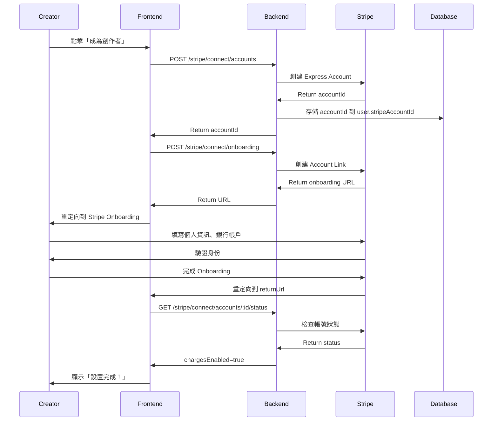

# Stripe Connect 創作者分潤整合指南

## 📋 目錄

1. [概述](#概述)
2. [核心概念](#核心概念)
3. [收款模式對比](#收款模式對比)
4. [環境配置](#環境配置)
5. [快速開始](#快速開始)
6. [創作者 Onboarding 流程](#創作者-onboarding-流程)
7. [支付分潤實現](#支付分潤實現)
8. [訂閱分潤](#訂閱分潤)
9. [批次轉帳](#批次轉帳)
10. [Dashboard 管理](#dashboard-管理)
11. [測試](#測試)
12. [常見問題](#常見問題)
13. [最佳實踐](#最佳實踐)

---

## 概述

**Stripe Connect** 是 Stripe 提供的平台支付解決方案，讓平台可以：

- ✅ 代表創作者收款
- ✅ 自動分潤（平台抽成）
- ✅ 合規處理稅務和 KYC
- ✅ 創作者可獨立管理收入
- ✅ 支持多種支付方式
- ✅ 全球支付支持

**使用場景**：
- 🎨 創作者訂閱平台（OnlyFans、Patreon）
- 🛒 電商市集（Etsy、Amazon）
- 🚗 共享經濟平台（Uber、Airbnb）
- 📚 線上課程平台（Udemy、Teachable）

---

## 核心概念

### 1. **Connect Account Types**

| 類型 | 適用場景 | 複雜度 | 品牌化 | KYC 責任 |
|------|----------|--------|--------|----------|
| **Express** | 大多數平台 | ⭐ 簡單 | Stripe | Stripe |
| **Custom** | 需要完全自定義 | ⭐⭐⭐ 複雜 | 平台 | 平台 |
| **Standard** | OAuth 流程 | ⭐⭐ 中等 | Stripe | Stripe |

**推薦**: 使用 **Express Account** 開始，簡單快速

### 2. **Key Terms**

- **Platform**: 你的應用（SuggarDaddy）
- **Connected Account**: 創作者的 Stripe 帳號
- **Application Fee**: 平台抽成
- **Transfer**: 資金轉帳
- **Onboarding**: 創作者註冊和驗證流程

---

## 收款模式對比

### 模式 1: Direct Charges（推薦）

**資金流**:
```
買家 --$100--> 創作者帳戶
               ├─ 平台抽成: $20
               └─ 創作者實收: $80 - Stripe Fee
```

**優點**:
- ✅ 資金直接進入創作者帳戶
- ✅ 平台不需處理資金
- ✅ 創作者承擔 Stripe 手續費
- ✅ 合規風險低

**缺點**:
- ❌ 退款需要創作者帳戶有足夠餘額
- ❌ 創作者看到完整交易記錄

**適用場景**: 大多數創作者平台

### 模式 2: Destination Charges

**資金流**:
```
買家 --$100--> 平台帳戶
               └─ 轉帳 $80 --> 創作者帳戶
```

**優點**:
- ✅ 平台完全控制資金流
- ✅ 退款容易處理
- ✅ 可以延遲支付創作者

**缺點**:
- ❌ 平台承擔 Stripe 手續費
- ❌ 平台需要更多合規審查
- ❌ 資金需要先進平台帳戶

**適用場景**: 需要審核內容或延遲支付的平台

---

## 環境配置

### Stripe Dashboard 設置

1. 前往 [Stripe Dashboard](https://dashboard.stripe.com/)
2. 啟用 **Connect**:
   - Settings → Connect → Get started
3. 配置 Connect 設定:
   - Brand name: "SuggarDaddy"
   - Brand color: 你的品牌顏色
   - Brand icon: 上傳 logo
4. 設置 OAuth（如使用 Standard）:
   - Redirect URIs: `https://yourdomain.com/stripe/oauth/callback`

### 環境變數

```bash
# Stripe 基本配置
STRIPE_SECRET_KEY=sk_test_xxxxx
STRIPE_PUBLISHABLE_KEY=pk_test_xxxxx
STRIPE_WEBHOOK_SECRET=whsec_xxxxx

# Stripe Connect 配置
PLATFORM_FEE_PERCENT=20  # 平台抽成 20%

# Connect OAuth (如果使用 Standard Account)
STRIPE_CLIENT_ID=ca_xxxxx
```

### Package 安裝

確保已安裝必要的依賴:

```bash
npm install stripe
npm install @nestjs/config
```

---

## 快速開始

### 步驟 1: 初始化 StripeConnectService

`StripeConnectService` 已包含在 `@suggar-daddy/common` 中。

在你的 module 中引入:

```typescript
import { Module } from '@nestjs/common';
import { ConfigModule } from '@nestjs/config';
import { StripeConnectService } from '@suggar-daddy/common';

@Module({
  imports: [ConfigModule],
  providers: [StripeConnectService],
  exports: [StripeConnectService],
})
export class StripeModule {}
```

### 步驟 2: 創建 Connect Controller

創建 `stripe-connect.controller.ts`:

```typescript
import {
  Controller,
  Post,
  Get,
  Body,
  Param,
  UseGuards,
  HttpCode,
  HttpStatus,
} from '@nestjs/common';
import { StripeConnectService } from '@suggar-daddy/common';
import { JwtAuthGuard } from '@suggar-daddy/auth';
import {
  CreateConnectAccountDto,
  CreateOnboardingLinkDto,
  CreateSplitPaymentDto,
  ConnectAccountStatusDto,
  OnboardingLinkResponseDto,
  SplitPaymentResponseDto,
} from '@suggar-daddy/dto';

@Controller('stripe/connect')
@UseGuards(JwtAuthGuard)
export class StripeConnectController {
  constructor(
    private readonly stripeConnectService: StripeConnectService,
  ) {}

  /**
   * 創建 Connect 帳號（創作者註冊）
   */
  @Post('accounts')
  @HttpCode(HttpStatus.CREATED)
  async createAccount(@Body() dto: CreateConnectAccountDto) {
    const accountId = await this.stripeConnectService.createExpressAccount(
      dto.email,
      dto.userId,
      dto.country || 'US',
    );

    return {
      accountId,
      message: 'Connect account created successfully',
    };
  }

  /**
   * 創建 Onboarding 連結
   */
  @Post('onboarding')
  @HttpCode(HttpStatus.OK)
  async createOnboardingLink(
    @Body() dto: CreateOnboardingLinkDto,
  ): Promise<OnboardingLinkResponseDto> {
    const result = await this.stripeConnectService.createOnboardingLink(
      dto.accountId,
      dto.refreshUrl,
      dto.returnUrl,
    );

    return {
      accountId: result.accountId,
      url: result.onboardingUrl,
      expiresAt: result.expiresAt,
    };
  }

  /**
   * 獲取帳號狀態
   */
  @Get('accounts/:accountId/status')
  async getAccountStatus(
    @Param('accountId') accountId: string,
  ): Promise<ConnectAccountStatusDto> {
    return this.stripeConnectService.getAccountStatus(accountId);
  }

  /**
   * 創建分潤支付
   */
  @Post('payments/split')
  @HttpCode(HttpStatus.OK)
  async createSplitPayment(
    @Body() dto: CreateSplitPaymentDto,
  ): Promise<SplitPaymentResponseDto> {
    const platformFee = this.stripeConnectService.calculatePlatformFee(
      dto.amount,
    );

    const result = await this.stripeConnectService.createDirectChargePayment({
      amount: dto.amount,
      currency: dto.currency,
      customerId: dto.customerId,
      destinationAccountId: dto.creatorAccountId,
      applicationFeeAmount: platformFee,
      description: dto.description,
      metadata: dto.metadata,
    });

    return {
      paymentIntentId: result.paymentIntentId,
      clientSecret: result.clientSecret,
      amount: dto.amount,
      platformFee,
      creatorAmount: dto.amount - platformFee,
      destinationAccountId: dto.creatorAccountId,
    };
  }

  /**
   * 獲取 Dashboard 登入連結
   */
  @Get('accounts/:accountId/dashboard')
  async getDashboardLink(@Param('accountId') accountId: string) {
    const url = await this.stripeConnectService.createDashboardLoginLink(
      accountId,
    );

    return {
      url,
      expiresAt: Date.now() + 5 * 60 * 1000, // 5 minutes
    };
  }
}
```

---

## 創作者 Onboarding 流程

### 完整流程圖



### 實現步驟

#### 步驟 1: 創建 Connect 帳號

當創作者點擊「成為創作者」時:

```typescript
// Frontend (React 範例)
const handleBecomeCreator = async () => {
  const response = await fetch('/api/stripe/connect/accounts', {
    method: 'POST',
    headers: {
      'Content-Type': 'application/json',
      'Authorization': `Bearer ${accessToken}`,
    },
    body: JSON.stringify({
      email: user.email,
      userId: user.userId,
      country: 'US', // 或根據用戶位置自動檢測
      accountType: 'express',
    }),
  });

  const { accountId } = await response.json();
  
  // 存儲到前端狀態
  setStripeAccountId(accountId);
  
  // 進入下一步
  startOnboarding(accountId);
};
```

#### 步驟 2: 啟動 Onboarding

```typescript
const startOnboarding = async (accountId: string) => {
  const response = await fetch('/api/stripe/connect/onboarding', {
    method: 'POST',
    headers: {
      'Content-Type': 'application/json',
      'Authorization': `Bearer ${accessToken}`,
    },
    body: JSON.stringify({
      accountId,
      refreshUrl: window.location.href, // 返回當前頁面
      returnUrl: `${window.location.origin}/creator/onboarding/success`,
    }),
  });

  const { url } = await response.json();
  
  // 重定向到 Stripe Onboarding
  window.location.href = url;
};
```

#### 步驟 3: 完成後檢查狀態

在 `returnUrl` 頁面:

```typescript
// /creator/onboarding/success
useEffect(() => {
  const checkStatus = async () => {
    const response = await fetch(
      `/api/stripe/connect/accounts/${accountId}/status`,
      {
        headers: {
          'Authorization': `Bearer ${accessToken}`,
        },
      }
    );

    const status = await response.json();

    if (status.chargesEnabled && status.detailsSubmitted) {
      // Onboarding 完成！
      setOnboardingComplete(true);
      showSuccessMessage('恭喜！你現在可以開始接收付款了！');
    } else {
      // 還有資料需要提供
      showWarningMessage('請完成剩餘資料...');
      // 顯示 status.requirements.currentlyDue
    }
  };

  checkStatus();
}, [accountId]);
```

---

## 支付分潤實現

### 場景 1: PPV（Pay-Per-View）購買

買家購買創作者的付費貼文:

```typescript
// payment-service/src/ppv/ppv.service.ts
import { Injectable } from '@nestjs/common';
import { StripeConnectService } from '@suggar-daddy/common';

@Injectable()
export class PPVService {
  constructor(
    private readonly stripeConnect: StripeConnectService,
    private readonly userService: UserService,
  ) {}

  async purchasePost(
    buyerId: string,
    postId: string,
    amount: number, // in cents
  ) {
    // 1. 獲取創作者資訊
    const post = await this.postsService.findOne(postId);
    const creator = await this.userService.findOne(post.creatorId);

    if (!creator.stripeAccountId) {
      throw new BadRequestException('Creator has not set up payments');
    }

    // 2. 檢查創作者帳號狀態
    const isReady = await this.stripeConnect.isAccountReady(
      creator.stripeAccountId,
    );

    if (!isReady) {
      throw new BadRequestException(
        'Creator account is not ready to receive payments',
      );
    }

    // 3. 獲取買家的 Stripe Customer ID
    const buyer = await this.userService.findOne(buyerId);
    
    if (!buyer.stripeCustomerId) {
      throw new BadRequestException('Buyer does not have payment method');
    }

    // 4. 計算平台抽成
    const platformFee = this.stripeConnect.calculatePlatformFee(amount);

    // 5. 創建分潤支付
    const payment = await this.stripeConnect.createDirectChargePayment({
      amount,
      currency: 'usd',
      customerId: buyer.stripeCustomerId,
      destinationAccountId: creator.stripeAccountId,
      applicationFeeAmount: platformFee,
      description: `PPV purchase for post ${postId}`,
      metadata: {
        type: 'ppv',
        postId,
        buyerId,
        creatorId: creator.userId,
      },
    });

    // 6. 記錄交易
    await this.transactionsService.create({
      transactionId: payment.paymentIntentId,
      type: 'ppv',
      amount,
      platformFee,
      creatorAmount: amount - platformFee,
      buyerId,
      creatorId: creator.userId,
      relatedEntityId: postId,
      status: 'pending',
    });

    return {
      clientSecret: payment.clientSecret,
      paymentIntentId: payment.paymentIntentId,
      amount,
      platformFee,
      creatorAmount: amount - platformFee,
    };
  }
}
```

### 場景 2: 打賞（Tips）

買家給創作者打賞:

```typescript
async tipCreator(
  fromUserId: string,
  toUserId: string,
  amount: number,
  message?: string,
) {
  const creator = await this.userService.findOne(toUserId);
  const tipper = await this.userService.findOne(fromUserId);

  if (!creator.stripeAccountId) {
    throw new BadRequestException('Creator cannot receive tips');
  }

  const platformFee = this.stripeConnect.calculatePlatformFee(amount);

  const payment = await this.stripeConnect.createDirectChargePayment({
    amount,
    currency: 'usd',
    customerId: tipper.stripeCustomerId,
    destinationAccountId: creator.stripeAccountId,
    applicationFeeAmount: platformFee,
    description: `Tip from ${tipper.displayName}`,
    metadata: {
      type: 'tip',
      fromUserId,
      toUserId,
      message: message || '',
    },
  });

  return {
    clientSecret: payment.clientSecret,
    paymentIntentId: payment.paymentIntentId,
  };
}
```

### 前端處理支付

```typescript
// Frontend (React + Stripe.js)
import { loadStripe } from '@stripe/stripe-js';
import { Elements, PaymentElement, useStripe, useElements } from '@stripe/react-stripe-js';

const stripePromise = loadStripe('pk_test_xxxxx');

const PPVCheckout = ({ postId, amount }) => {
  const [clientSecret, setClientSecret] = useState('');

  useEffect(() => {
    // 創建支付
    fetch('/api/ppv/purchase', {
      method: 'POST',
      headers: {
        'Content-Type': 'application/json',
        'Authorization': `Bearer ${accessToken}`,
      },
      body: JSON.stringify({ postId, amount }),
    })
      .then(res => res.json())
      .then(data => setClientSecret(data.clientSecret));
  }, []);

  return (
    <Elements stripe={stripePromise} options={{ clientSecret }}>
      <CheckoutForm />
    </Elements>
  );
};

const CheckoutForm = () => {
  const stripe = useStripe();
  const elements = useElements();

  const handleSubmit = async (e) => {
    e.preventDefault();

    if (!stripe || !elements) return;

    const { error } = await stripe.confirmPayment({
      elements,
      confirmParams: {
        return_url: `${window.location.origin}/payment/success`,
      },
    });

    if (error) {
      alert(error.message);
    }
  };

  return (
    <form onSubmit={handleSubmit}>
      <PaymentElement />
      <button type="submit" disabled={!stripe}>
        支付 ${amount / 100}
      </button>
    </form>
  );
};
```

---

## 訂閱分潤

創作者訂閱每月自動分潤:

```typescript
// subscription-service/src/subscription.service.ts
async createSubscriptionWithSplit(
  subscriberId: string,
  creatorId: string,
  priceId: string, // Stripe Price ID
) {
  const creator = await this.userService.findOne(creatorId);
  const subscriber = await this.userService.findOne(subscriberId);

  if (!creator.stripeAccountId) {
    throw new BadRequestException('Creator cannot receive subscriptions');
  }

  const result = await this.stripeConnect.createSubscriptionWithSplit(
    subscriber.stripeCustomerId,
    priceId,
    creator.stripeAccountId,
    {
      subscriberId,
      creatorId,
      type: 'subscription',
    },
  );

  // 記錄訂閱到 DB
  await this.subscriptionsRepository.save({
    subscriptionId: result.subscriptionId,
    subscriberId,
    creatorId,
    priceId,
    status: 'active',
    platformFeePercent: 20,
  });

  return result;
}
```

---

## 批次轉帳

用於月結場景（如果使用 Destination Charges 模式）:

```typescript
// settlement-service/src/settlement.service.ts
async monthlySettlement() {
  const creators = await this.getCreatorsForSettlement();

  const transfers = creators.map(creator => ({
    amount: creator.pendingAmount,
    currency: 'usd',
    destinationAccountId: creator.stripeAccountId,
    description: `Monthly settlement for ${creator.displayName}`,
    metadata: {
      creatorId: creator.userId,
      period: new Date().toISOString(),
    },
  }));

  const transferIds = await this.stripeConnect.batchTransfer(transfers);

  this.logger.log(`Completed ${transferIds.length} transfers`);
  
  // 更新結算記錄
  await this.markAsSettled(creators, transferIds);
}
```

---

## Dashboard 管理

讓創作者可以訪問自己的 Stripe Dashboard:

```typescript
// Backend
@Get('creator/dashboard')
@UseGuards(JwtAuthGuard)
async getCreatorDashboard(@CurrentUser() user: User) {
  if (!user.stripeAccountId) {
    throw new BadRequestException('No Connect account');
  }

  const url = await this.stripeConnect.createDashboardLoginLink(
    user.stripeAccountId,
  );

  return { url };
}

// Frontend
const viewDashboard = async () => {
  const response = await fetch('/api/creator/dashboard', {
    headers: {
      'Authorization': `Bearer ${accessToken}`,
    },
  });

  const { url } = await response.json();
  
  // 在新窗口打開 Dashboard
  window.open(url, '_blank');
};
```

---

## 測試

### 測試帳號

Stripe 提供測試環境:

**測試卡號**:
```
4242 4242 4242 4242 - 成功
4000 0000 0000 9995 - 餘額不足
4000 0000 0000 0002 - 卡片被拒
```

**測試銀行帳號（美國）**:
```
Routing number: 110000000
Account number: 000123456789
```

### E2E 測試

```typescript
describe('Stripe Connect (e2e)', () => {
  let app: INestApplication;
  let stripeConnect: StripeConnectService;

  beforeAll(async () => {
    const module = await Test.createTestingModule({
      imports: [AppModule],
    }).compile();

    app = module.createNestApplication();
    await app.init();

    stripeConnect = module.get<StripeConnectService>(StripeConnectService);
  });

  it('should create Express account', async () => {
    const accountId = await stripeConnect.createExpressAccount(
      'test@example.com',
      'user-123',
      'US',
    );

    expect(accountId).toMatch(/^acct_/);
  });

  it('should create onboarding link', async () => {
    const accountId = 'acct_test_123';
    
    const result = await stripeConnect.createOnboardingLink(
      accountId,
      'http://localhost/refresh',
      'http://localhost/return',
    );

    expect(result.onboardingUrl).toContain('stripe.com');
    expect(result.expiresAt).toBeGreaterThan(Date.now() / 1000);
  });

  it('should create split payment', async () => {
    const result = await stripeConnect.createDirectChargePayment({
      amount: 10000, // $100
      currency: 'usd',
      customerId: 'cus_test_123',
      destinationAccountId: 'acct_test_456',
      applicationFeeAmount: 2000, // $20 platform fee
      description: 'Test payment',
    });

    expect(result.paymentIntentId).toMatch(/^pi_/);
    expect(result.clientSecret).toBeTruthy();
  });
});
```

---

## 常見問題

### Q1: 平台抽成多少合適？

**A**: 常見範圍:
- **OnlyFans**: 20%
- **Patreon**: 5-12%
- **Udemy**: 50% (含行銷成本)
- **App Store**: 30% (或 15% 小企業)

建議: **15-20%** 是合理範圍

### Q2: 創作者如何提現？

**A**: Stripe 自動處理:
- **美國**: 2個工作日到銀行帳戶
- **其他國家**: 3-7個工作日
- 創作者在 Stripe Dashboard 設置提現頻率

### Q3: 如何處理退款？

**A**: 
```typescript
// 退款會從創作者帳戶扣除
const refund = await stripe.refunds.create({
  payment_intent: 'pi_xxxxx',
  // 平台抽成也會退還
  refund_application_fee: true,
});
```

注意: 創作者帳戶需要有足夠餘額

### Q4: 支持哪些國家？

**A**: Stripe Connect 支持 46+ 國家/地區，包括:
- 🇺🇸 美國
- 🇬🇧 英國
- 🇨🇦 加拿大
- 🇦🇺 澳洲
- 🇯🇵 日本
- 🇸🇬 新加坡

查看完整列表: [Stripe Global](https://stripe.com/global)

⚠️ 台灣目前不支持 Connect，但支持標準 Stripe 支付

### Q5: 如何處理稅務？

**A**: Stripe 自動處理:
- **美國**: 提供 1099-K 表格給創作者
- **歐盟**: VAT 處理
- 創作者在 Onboarding 時提供稅務資訊

### Q6: Platform fee 上限是多少？

**A**: Stripe 沒有硬性上限，但建議:
- 不要超過 **25%**（用戶接受度問題）
- 明確告知創作者費用結構
- 透明化費用計算

### Q7: 如何處理爭議（Disputes）？

**A**: 
1. Stripe 自動處理爭議流程
2. 平台會收到 webhook: `charge.dispute.created`
3. 創作者需要提供證據
4. 爭議會暫停提現

```typescript
// Webhook handler
if (event.type === 'charge.dispute.created') {
  const dispute = event.data.object;
  // 通知創作者
  await this.notifyCreatorOfDispute(dispute);
}
```

### Q8: 可以更改 application_fee_amount 嗎？

**A**: 
- ❌ 支付創建後**不能**更改
- ✅ 可以為不同創作者設置不同費率
- ✅ 可以根據訂閱級別調整費率

---

## 最佳實踐

### 1. ✅ 透明化費用

在 UI 清楚顯示費用分配:

```
購買金額: $100.00
平台手續費 (20%): -$20.00
創作者實收: $80.00
```

### 2. ✅ 監控帳號狀態

定期檢查創作者帳號狀態:

```typescript
@Cron('0 0 * * *') // 每天檢查
async checkConnectAccountsHealth() {
  const creators = await this.getCreatorsWithConnect();

  for (const creator of creators) {
    const status = await this.stripeConnect.getAccountStatus(
      creator.stripeAccountId,
    );

    if (!status.chargesEnabled) {
      // 通知創作者完成驗證
      await this.notifyCreator(creator, 'VERIFY_ACCOUNT');
    }

    if (status.requirements.pastDue.length > 0) {
      // 緊急通知
      await this.notifyCreator(creator, 'URGENT_VERIFICATION');
    }
  }
}
```

### 3. ✅ Webhook 處理

監聽重要的 Connect events:

```typescript
// stripe-webhook.service.ts
switch (event.type) {
  case 'account.updated':
    // 創作者帳號狀態更新
    await this.handleAccountUpdated(event.data.object);
    break;

  case 'account.application.deauthorized':
    // 創作者解除授權
    await this.handleDeauthorized(event.account);
    break;

  case 'payment_intent.succeeded':
    // 支付成功
    await this.handlePaymentSuccess(event.data.object);
    break;

  case 'charge.refunded':
    // 退款
    await this.handleRefund(event.data.object);
    break;
}
```

### 4. ✅ 緩存帳號狀態

避免頻繁調用 Stripe API:

```typescript
@Injectable()
export class ConnectAccountCache {
  async getAccountStatus(accountId: string) {
    // 先查 Redis 緩存
    const cached = await this.redis.get(`connect:status:${accountId}`);
    
    if (cached) {
      return JSON.parse(cached);
    }

    // 沒有緩存，調用 Stripe API
    const status = await this.stripeConnect.getAccountStatus(accountId);

    // 緩存 1 小時
    await this.redis.set(
      `connect:status:${accountId}`,
      JSON.stringify(status),
      'EX',
      3600,
    );

    return status;
  }
}
```

### 5. ✅ 安全性考量

- ✅ 永遠在**後端**創建支付
- ✅ 驗證創作者帳號 ownership
- ✅ Rate limiting Connect API calls
- ✅ 記錄所有交易到審計日誌

```typescript
@UseGuards(ThrottlerGuard)
@Throttle({ default: { limit: 10, ttl: 60000 } })
@Post('payments/split')
async createSplitPayment() {
  // ...
}
```

### 6. ✅ 用戶體驗優化

**Onboarding 進度指示器**:

```typescript
const OnboardingProgress = ({ accountId }) => {
  const [progress, setProgress] = useState(0);

  useEffect(() => {
    const checkProgress = async () => {
      const status = await getAccountStatus(accountId);
      
      let completedSteps = 0;
      if (status.detailsSubmitted) completedSteps++;
      if (status.chargesEnabled) completedSteps++;
      if (status.payoutsEnabled) completedSteps++;
      
      setProgress((completedSteps / 3) * 100);
    };

    checkProgress();
  }, [accountId]);

  return (
    <div>
      <ProgressBar value={progress} />
      <p>{progress}% 完成</p>
    </div>
  );
};
```

---

## 相關文檔

- [STRIPE.md](./STRIPE.md) - Stripe 基本整合
- [OAUTH_GUIDE.md](./OAUTH_GUIDE.md) - OAuth 第三方登入
- [ERROR_HANDLING_GUIDE.md](./ERROR_HANDLING_GUIDE.md) - 錯誤處理

---

## 附錄

### Stripe Connect Webhooks

重要的 Webhook events:

```typescript
const CONNECT_WEBHOOK_EVENTS = [
  'account.updated',
  'account.application.authorized',
  'account.application.deauthorized',
  'account.external_account.created',
  'account.external_account.deleted',
  'capability.updated',
  'person.created',
  'person.updated',
  'payment_intent.succeeded',
  'payment_intent.payment_failed',
  'charge.refunded',
  'transfer.created',
  'transfer.failed',
  'payout.paid',
  'payout.failed',
];
```

### 費用計算範例

```typescript
// 範例: 買家付款 $100
const amount = 10000; // $100.00 in cents
const platformFeePercent = 20; // 20%
const stripeFeePercent = 2.9; // Stripe 手續費
const stripeFeeFixed = 30; // Stripe 固定費用 $0.30

// 平台抽成
const platformFee = (amount * platformFeePercent) / 100; // $20.00

// Stripe 手續費（由創作者承擔）
const stripeFee = Math.round((amount * stripeFeePercent) / 100 + stripeFeeFixed); // $3.20

// 創作者實收
const creatorNet = amount - platformFee - stripeFee; // $76.80

console.log(`
買家付款: $${amount / 100}
平台抽成 (${platformFeePercent}%): $${platformFee / 100}
Stripe 手續費: $${stripeFee / 100}
創作者實收: $${creatorNet / 100}
`);
```

---

**最後更新**: 2026-02-13  
**維護者**: Engineering Team  
**狀態**: ✅ Production Ready
