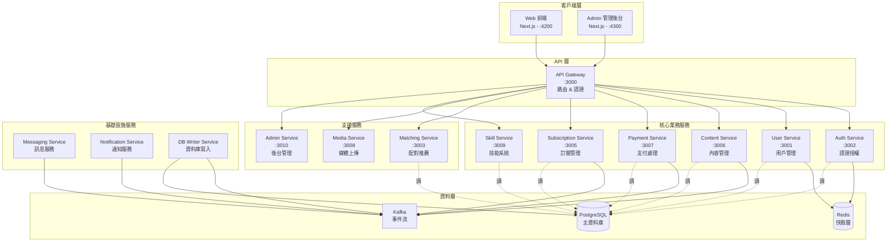
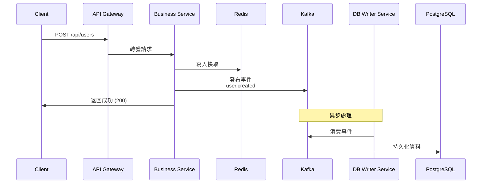
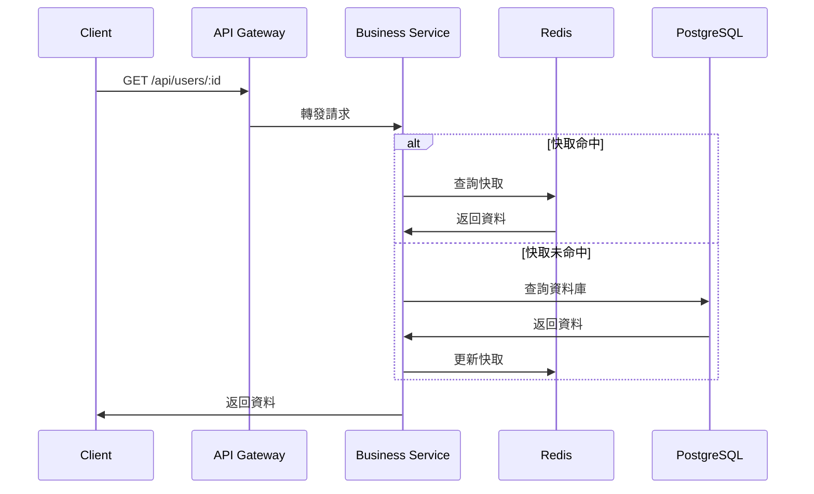

# 服務總覽

Sugar Daddy 採用微服務架構，本文檔提供所有服務的概覽和職責說明。

## 架構圖



## 服務列表

### 🌐 前端應用

#### Web (用戶端)
- **端口**: 4200
- **技術**: Next.js 14 (App Router)
- **職責**: 
  - 用戶註冊、登入
  - 個人資料管理
  - 內容瀏覽與互動
  - 訂閱與支付
  - 即時訊息
- **文檔**: [apps/web/README.md](../../apps/web/README.md)

#### Admin (管理後台)
- **端口**: 4300
- **技術**: Next.js 14 + shadcn/ui
- **職責**:
  - 用戶管理
  - 內容審核
  - 數據統計
  - 系統配置
- **文檔**: [apps/admin/README.md](../../apps/admin/README.md)

---

### 🚪 API 層

#### API Gateway
- **端口**: 3000
- **職責**:
  - 統一入口點（所有 `/api/*` 請求）
  - 請求路由到對應微服務
  - JWT 認證中介層
  - 速率限制
  - 請求日誌
- **路由規則**: 詳見 `apps/api-gateway/src/app/proxy.service.ts`
- **文檔**: [apps/api-gateway/README.md](../../apps/api-gateway/README.md)

---

### 🔐 核心業務服務

#### Auth Service
- **端口**: 3002
- **路由**: `/api/auth`
- **職責**:
  - 用戶註冊、登入、登出
  - JWT Token 生成與驗證
  - 密碼加密與驗證
  - 角色權限管理 (RBAC)
- **技術**: JWT, Passport, bcrypt
- **依賴**: PostgreSQL (讀), Redis (Session)
- **文檔**: [apps/auth-service/README.md](../../apps/auth-service/README.md)

#### User Service
- **端口**: 3001
- **路由**: `/api/users`
- **職責**:
  - 用戶資料 CRUD
  - 個人資料管理
  - 用戶搜尋與過濾
  - 用戶狀態管理
- **依賴**: PostgreSQL (讀), Kafka (寫事件)
- **文檔**: [apps/user-service/README.md](../../apps/user-service/README.md)

#### Content Service
- **端口**: 3006
- **路由**: `/api/posts`
- **職責**:
  - 內容發布與管理
  - 內容瀏覽與搜尋
  - 點讚、評論、分享
  - 內容審核狀態
- **依賴**: PostgreSQL (讀), Kafka (寫事件), Redis (快取)
- **文檔**: [apps/content-service/README.md](../../apps/content-service/README.md)

#### Payment Service
- **端口**: 3007
- **路由**: `/api/tips`, `/api/post-purchases`, `/api/transactions`, `/api/stripe`
- **職責**:
  - Stripe 支付整合
  - 打賞功能
  - 內容購買
  - 交易歷史
  - Webhook 處理
- **技術**: Stripe SDK
- **依賴**: PostgreSQL (讀), Kafka (寫事件)
- **文檔**: [apps/payment-service/README.md](../../apps/payment-service/README.md)

#### Subscription Service
- **端口**: 3005
- **路由**: `/api/subscription-tiers`, `/api/subscriptions`
- **職責**:
  - 訂閱方案管理
  - 用戶訂閱狀態
  - 自動續訂
  - 訂閱取消與退款
- **依賴**: PostgreSQL (讀), Kafka (寫事件)
- **文檔**: [apps/subscription-service/README.md](../../apps/subscription-service/README.md)

#### Skill Service
- **端口**: 3009
- **路由**: `/api/skills`
- **職責**:
  - 技能系統管理
  - 用戶技能設定
  - 技能匹配
  - 技能分類
- **依賴**: PostgreSQL (讀), Kafka (寫事件)
- **文檔**: [apps/skill-service/README.md](../../apps/skill-service/README.md)

---

### 🔧 支援服務

#### Matching Service
- **端口**: 3003
- **路由**: `/api/matching`
- **職責**:
  - 用戶配對算法
  - 推薦系統
  - 配對歷史
- **依賴**: PostgreSQL (讀), Redis (快取推薦結果)
- **文檔**: [apps/matching-service/README.md](../../apps/matching-service/README.md)

#### Media Service
- **端口**: 3008
- **路由**: `/api/upload`, `/api/media`
- **職責**:
  - 圖片/影片上傳
  - 媒體處理（壓縮、裁切）
  - CDN 整合
  - 媒體管理
- **技術**: Cloudinary (預設)
- **依賴**: Kafka (上傳事件)
- **文檔**: [apps/media-service/README.md](../../apps/media-service/README.md)

#### Admin Service
- **端口**: 3010
- **路由**: `/api/admin`
- **職責**:
  - 管理後台 API
  - 用戶管理功能
  - 內容審核
  - 統計報表
- **依賴**: PostgreSQL (讀寫)
- **文檔**: [apps/admin-service/README.md](../../apps/admin-service/README.md)

---

### ⚙️ 基礎設施服務

#### DB Writer Service
- **端口**: 無（Kafka Consumer）
- **職責**:
  - **唯一**寫入 PostgreSQL 的服務
  - 監聽 Kafka 事件
  - 資料持久化
  - 事務管理
- **模式**: Event Sourcing + CQRS
- **監聽主題**: 
  - `user.*`
  - `content.*`
  - `payment.*`
  - `subscription.*`
  - `skill.*`
- **文檔**: [apps/db-writer-service/README.md](../../apps/db-writer-service/README.md)

#### Messaging Service
- **端口**: 無（Kafka Consumer）
- **職責**:
  - 即時訊息處理
  - 聊天室管理
  - 訊息歷史
  - WebSocket 連接管理
- **依賴**: Kafka (消費訊息事件)
- **文檔**: [apps/messaging-service/README.md](../../apps/messaging-service/README.md)

#### Notification Service
- **端口**: 無（Kafka Consumer）
- **職責**:
  - 推播通知
  - Email 通知
  - 站內通知
  - 通知模板管理
- **依賴**: Kafka (消費通知事件)
- **文檔**: [apps/notification-service/README.md](../../apps/notification-service/README.md)

---

## 數據流模式

### 寫入流程（CQRS + Event Sourcing）



### 讀取流程



---

## 技術棧

### 後端
- **框架**: NestJS
- **語言**: TypeScript
- **ORM**: TypeORM
- **驗證**: class-validator, class-transformer
- **文檔**: Swagger / OpenAPI

### 資料層
- **資料庫**: PostgreSQL 14+ (主從架構)
- **快取**: Redis 7+ (Sentinel 高可用)
- **訊息佇列**: Kafka (事件流)

### 前端
- **框架**: Next.js 14 (App Router)
- **語言**: TypeScript
- **樣式**: Tailwind CSS
- **UI 組件**: shadcn/ui (僅 Admin)
- **狀態管理**: React Query / SWR

---

## 服務間通訊

### 同步通訊
- **方式**: HTTP REST API (透過 API Gateway)
- **用途**: 查詢操作、即時回應需求
- **認證**: JWT Token

### 異步通訊
- **方式**: Kafka 事件流
- **用途**: 寫入操作、非即時需求
- **模式**: Pub/Sub

### 快取策略
- **L1**: Service 內存快取 (Node.js)
- **L2**: Redis 分散式快取
- **TTL**: 依據資料特性設定 (5分鐘 ~ 1小時)

---

## 部署架構

### 開發環境
```
Docker Compose
├── PostgreSQL (單節點)
├── Redis (單節點)
├── Kafka (單節點)
└── 所有微服務
```

### 生產環境
```
Kubernetes / Cloud Platform
├── PostgreSQL (主從複製 + 讀寫分離)
├── Redis Sentinel (3 節點高可用)
├── Kafka Cluster (3+ 節點)
├── 微服務 (Auto-scaling)
└── Load Balancer
```

---

## 監控與日誌

### 健康檢查
所有服務提供 `/health` 端點：
- **Liveness**: 服務是否運行
- **Readiness**: 服務是否準備好接收流量
- **檢查項**: 資料庫連接、Redis 連接、Kafka 連接

### 日誌
- **格式**: JSON 結構化日誌
- **層級**: ERROR, WARN, INFO, DEBUG
- **聚合**: 集中式日誌收集 (ELK / CloudWatch)

### 監控指標
- 請求吞吐量 (RPS)
- 回應時間 (P50, P95, P99)
- 錯誤率
- 資源使用 (CPU, Memory)

---

## 開發指南

### 啟動單一服務
```bash
nx serve <service-name>
# 例如: nx serve user-service
```

### 啟動完整環境
```bash
npm run dev          # 核心服務 + web
npm run dev:all      # 所有服務
npm run dev:core     # 只有後端核心服務
```

### 測試
```bash
nx test <service-name>              # 單一服務測試
npm run test:unit                   # 所有單元測試
npm run test:integration            # 整合測試
npm run test:e2e                    # E2E 測試
```

---

## 相關文檔

- [架構決策記錄 (ADR)](./ADR-001-Pre-Launch-Architecture-Review.md)
- [技術債務追蹤](./technical-debt.md)
- [擴展性分析](./scalability-analysis.md)
- [安全審查](./security-review.md)
- [API 文檔](../technical/api.md)
- [部署指南](../technical/deployment.md)
